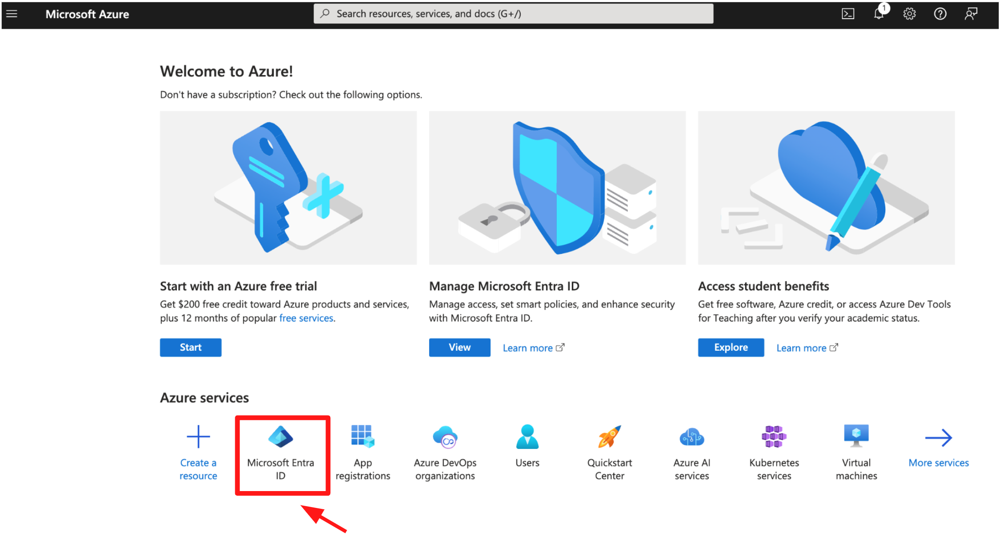
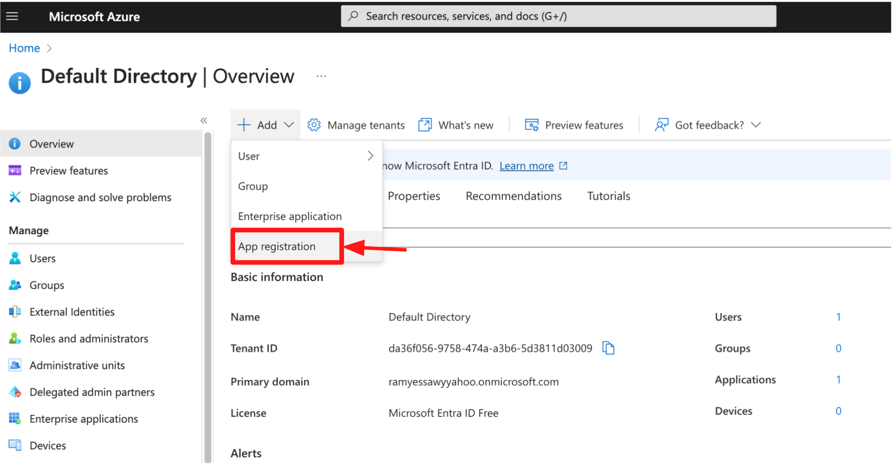
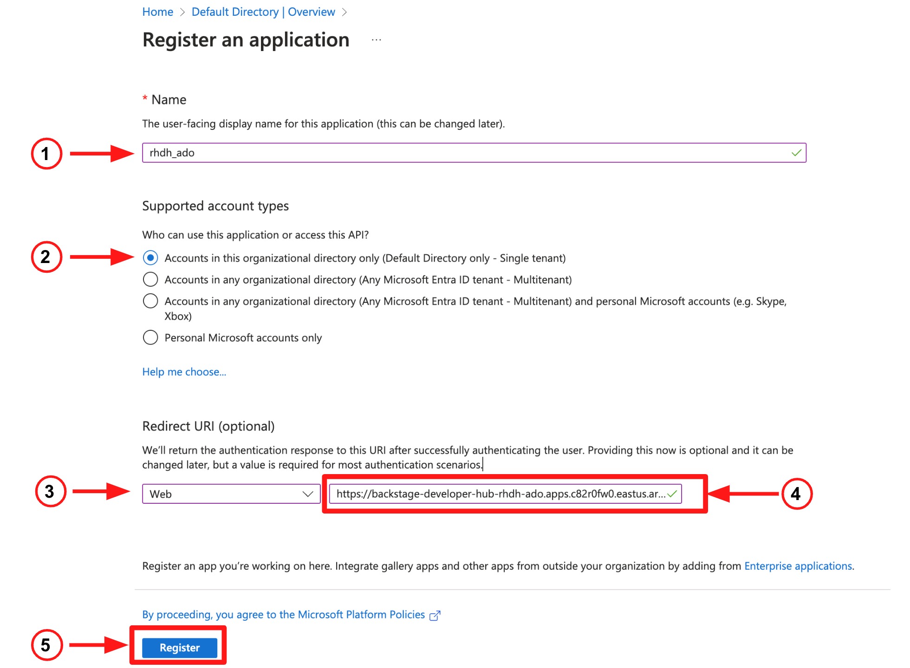
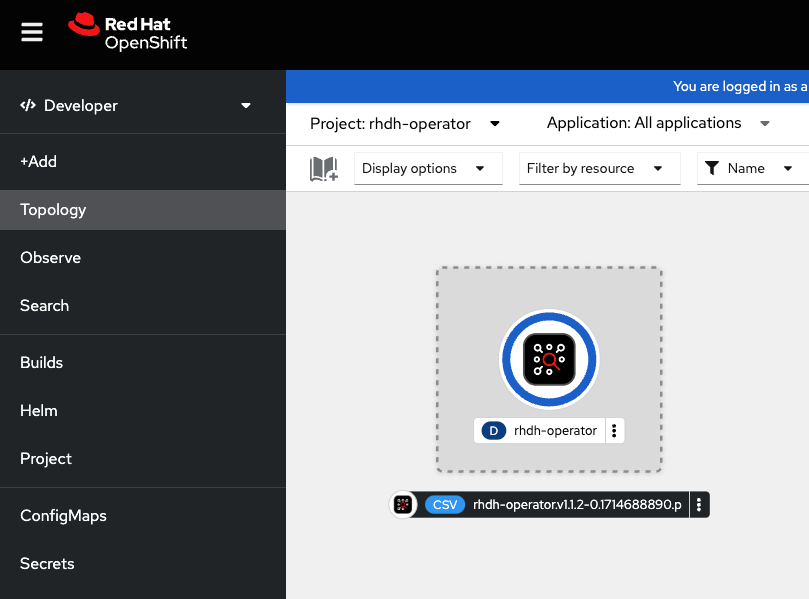

== Red Hat Developer Hub (RHDH) on Azure setup guide

== Find the Base Domain for your OpenShift cluster

* The base domain for the OpenShift cluster will be used in the coming steps, so let's start by finding it.
* Login to your OpenShift cluster, then execute the following command.

[source, role="execute"]
----
export basedomain=$(oc get ingresscontroller -n openshift-ingress-operator default -o jsonpath='{.status.domain}')
----

* In this example, the value for the variable *basedomain* is apps.c82r0fw0.eastus.aroapp.io

* Let's also create a new project in OpenShift for Red Hat Developer Hub (RHDH), in this example we will use a project named *rhdh-ado*

[source, role="execute"]
----
oc new-project rhdh-ado
----

== Configure Microsoft Azure for Authentication

* To authenticate with Microsoft Azure, we need to create an link:https://learn.microsoft.com/en-us/azure/devops/integrate/get-started/authentication/service-principal-managed-identity?view=azure-devops#create-an-application-service-principal[*Application Service Principal*,window=_blank] in *Microsoft Entra ID*.
* Login to the link:https://portal.azure.com/[*Azure Portal*,window=_blank] (or create a new free account).
* Click on *Microsoft Entra ID*.

* In the top menu, select *+Add*, then select *App registration* from the drop-down list.

[]

* On the *Register an application* page:
. Provide an application name
. Select the first radio button, to configure a single tenant application.
. Under the the Redirect URI section, select Web from the drop down list. 
. Provide a return URI: https://backstage-developer-hub-<project-name><base_domain>/api/auth/microsoft/handler/frame , so in our example the URI value would be https://backstage-developer-hub-rhdh-ado.apps.c82r0fw0.eastus.aroapp.io/api/auth/microsoft/handler/frame
. click the *Register* button.

=== Install and Setup RHDH

* Start by installing the RHDH operator. Running the following  command will install the *RHDH operator* in the project *rhdh-operator*.

[source, role="execute"]
----
oc apply -f ./common_config_files/rhdh-operator.yaml
----

* Wait until the operator is installed before you proceed to the next step. Use this command to check the operator status:

[source, role="execute"]
----
oc get csv -n rhdh-operator
NAME                                  DISPLAY                          VERSION                REPLACES               PHASE
rhdh-operator.v1.1.2-0.1714688890.p   Red Hat Developer Hub Operator   1.1.2+0.1714688890.p   rhdh-operator.v1.1.1   Succeeded
----

* Next create a backend secret. 
* You can use the following command to generate a base64 encoded string value for the backend secret and replace the value in the file /config_files/rhdh_backend_secret.yaml

[source, role="execute"]
----
node -p 'require("crypto").randomBytes(24).toString("base64")'
ZHLz5K44dsezsM2PU7qhl25i73SSwnvJ
----

* Create the secret using the following command:

[source, role="execute"]
----
oc apply -f ./config_files/rhdh-secret.yaml
----

* The next commands will create:
. The *app_config* configmap the includes RHDH custom configurations
. The *dynamic-plugins* config map that enables the plugins we will use in this setup
. The *RHDH manifest* to create the RHDH instance

[source, role="execute"]
----
oc apply -f ./rhdh_azure_config_files/dynamic-plugins.yaml
oc apply -f ./rhdh_azure_config_files/rhdh-azure-manifest.yaml
----
