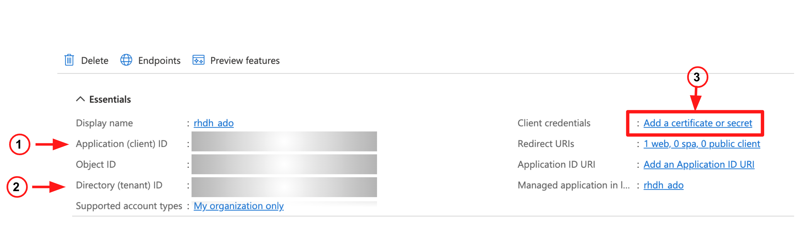
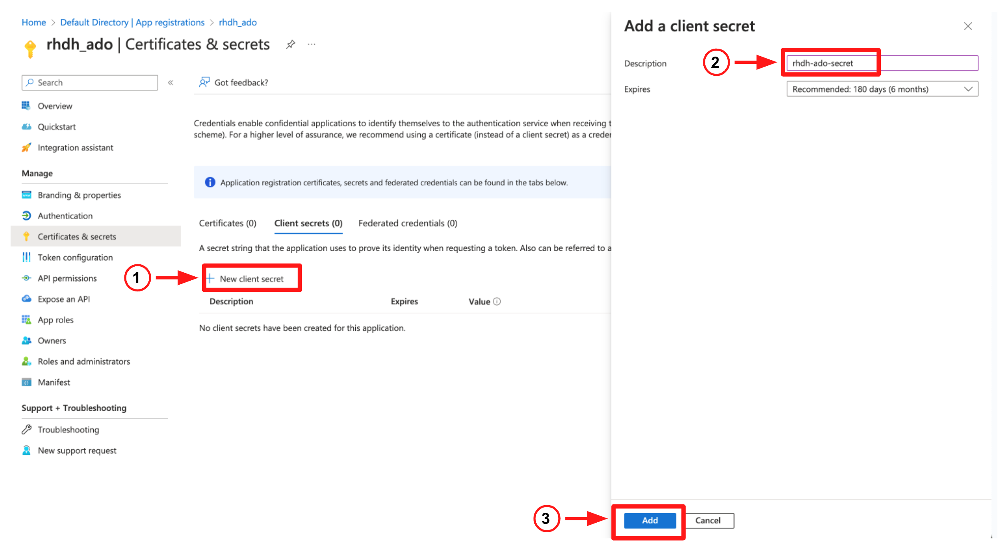
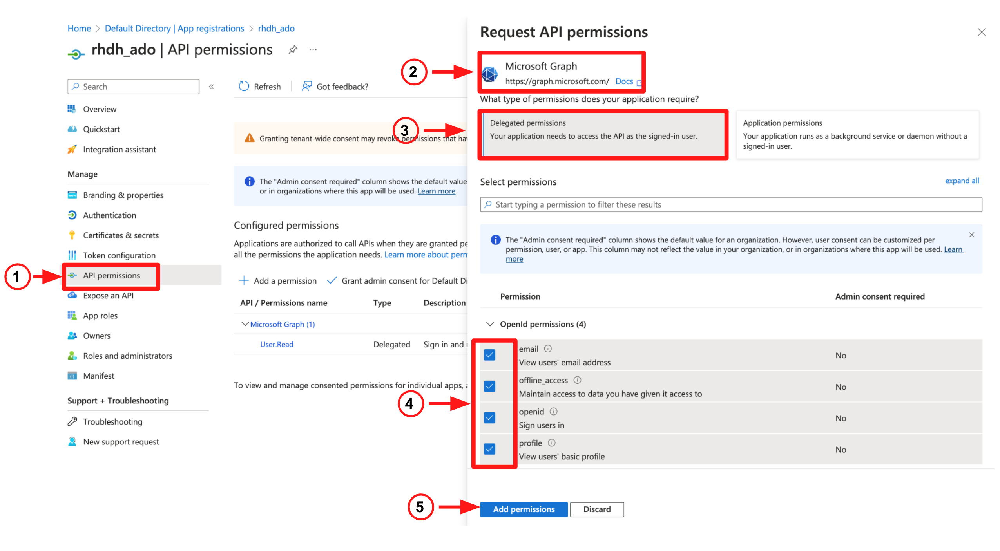
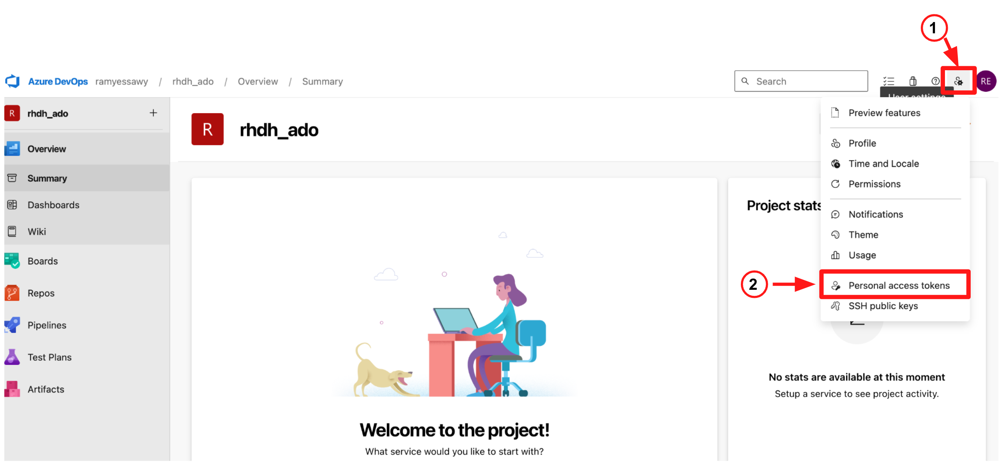
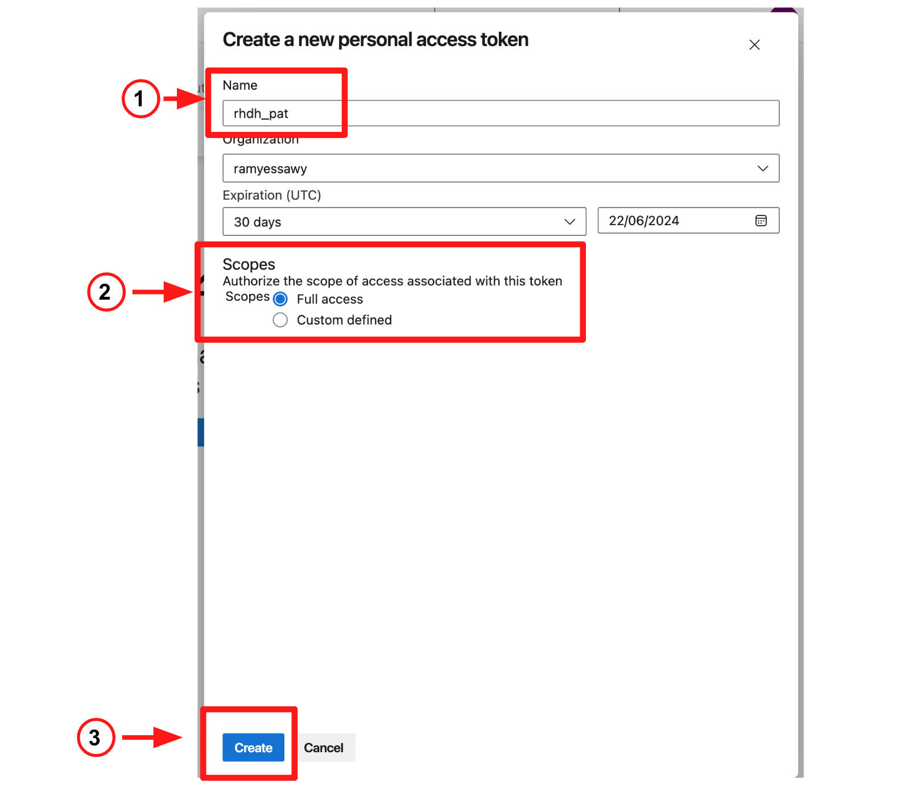
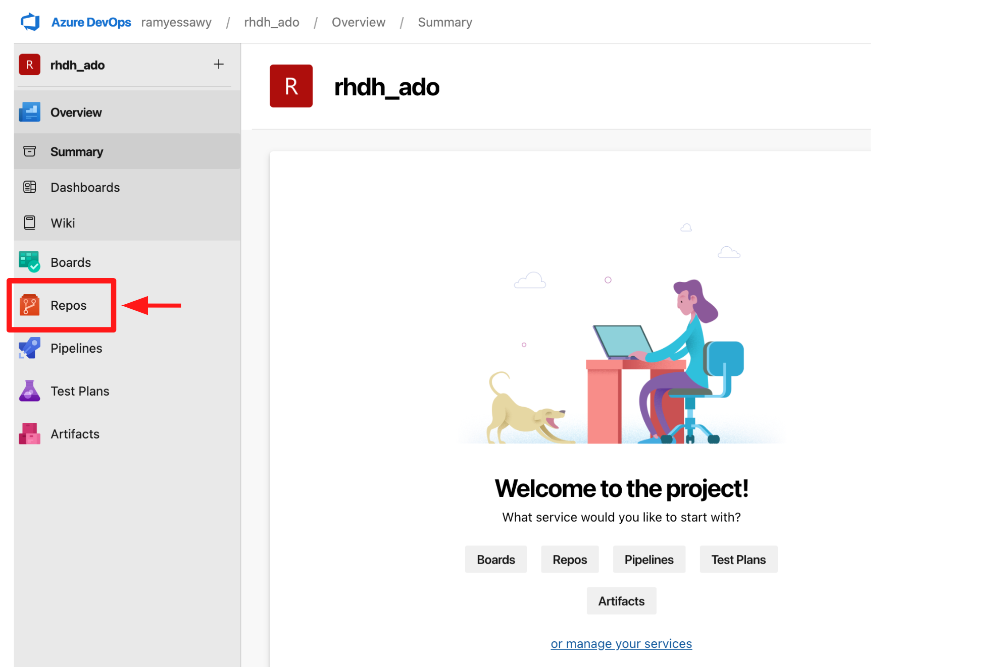
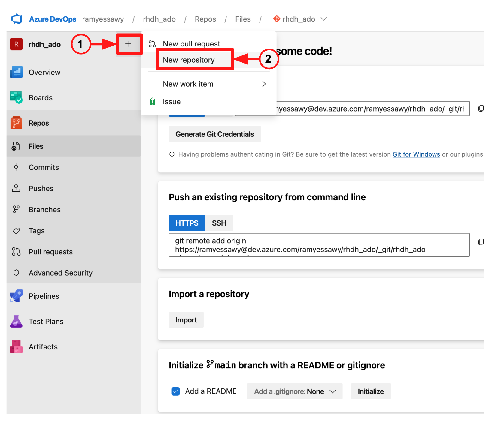

== Red Hat Developer Hub (RHDH) on Azure setup guide

* This guide comprises three sections:
. Configuring Microsoft Azure for authentication
. Configuring Microsoft Azure DevOps (ADO) for integration with RHDH
. Installing and configuring the Red Hat Developer Hub (RHDH) on OpenShift

== Find the Base Domain for your OpenShift Cluster

* The base domain for the OpenShift cluster will be used in the coming steps, so let's start by finding it.
* Login to your OpenShift cluster, then execute the following command:

[source, role="execute"]
----
export basedomain=$(oc get ingresscontroller -n openshift-ingress-operator default -o jsonpath='{.status.domain}')
----

* In this example, the value for the variable *basedomain* is `apps.c82r0fw0.eastus.aroapp.io`.

* Let's also create a new project in OpenShift for Red Hat Developer Hub (RHDH). In this example, we will use a project named *rhdh-ado*.

[source, role="execute"]
----
oc new-project rhdh-ado
----

== Configure Microsoft Azure for Authentication

* To authenticate with Microsoft Azure, we need to create an link:https://learn.microsoft.com/en-us/azure/devops/integrate/get-started/authentication/service-principal-managed-identity?view=azure-devops#create-an-application-service-principal[*Application Service Principal*,window=_blank] in *Microsoft Entra ID*.
* Login to the link:https://portal.azure.com/[*Azure Portal*,window=_blank] (or create a new free account).
* Click on *Microsoft Entra ID*.

image::./assets/images/microsoft_entraid.png[Microsoft Entra ID]

* In the top menu, select *+Add*, then select *App registration* from the drop-down list.

image::./assets/images/add_app_registration.png[Add App Registration]

* On the *Register an application* page:
  . Provide an application name.
  . Select the first radio button to configure a single-tenant application.
  . Under the Redirect URI section, select Web from the drop-down list.
  . Provide a return URI: `https://backstage-developer-hub-<project-name><base_domain>/api/auth/microsoft/handler/frame`, so in our example the URI value would be `https://backstage-developer-hub-rhdh-ado.apps.c82r0fw0.eastus.aroapp.io/api/auth/microsoft/handler/frame`.
  . Click the *Register* button.

image::./assets/images/register_an_application.png[Register an Application]

* Take note of the Client ID and Tenant ID on the screen; we will use them in the coming steps to configure RHDH authentication.
* Click on the link *Add a certificate or secret*.

* In the application *Certificates & secrets* screen, click on *+ New client secret*, provide a *Description*, then click the *Add* button.

* Take note of the Secret ID on the next screen.
* The last step is to add application permissions:
  . Select *API permissions* from the left menu.
  . Click *+ Add a permission*.
  . Click *Microsoft Graph*.
  . Select *Delegated permissions*.
  . Tick the following permissions: email, offline_access, openid, profile.

* To recap, we generated three IDs that we will use to configure authentication in *RHDH*:
  . Client ID
  . Secret ID
  . Tenant ID

== Configure Microsoft Azure DevOps (ADO) for integration with RHDH

* Login to your link:https://dev.azure.com/[*Azure DevOps portal*,window=_blank].
* Create a new project by clicking on the *+ New Project+* button. In this example the project name is *rhdh_ado*
* The next step is to create a *Personal Access Token (PAT)*
* Click on *User Setting* at the top right of your screen, then select *Personal access tokens*.

* Click on the *+New Token+ button.
* Provide a name for the *PAT*,  set the scope to *Full access*, then click the *Create* button.

  

* Make sure to copy and store the generated token as you will not be able to view it again.
* Navigate back to your project and click on *Repos* in the left menu.

* Click on the *+ sign+ next to the project name
* Then select *New repository* from the menu

* Create a new file within the repository and name it catalog-info.yaml
* Paste the content of of the file ./config_file/catalog-info.yaml in the new file you created and commit your change.

=== Install and Setup Red Hat Developer Hub (RHDH)

* Start by installing the RHDH operator. Running the following command will install the *RHDH operator* in the project *rhdh-operator*.

[source, role="execute"]
----
oc apply -f ./common_config_files/rhdh-operator.yaml
----

* Wait until the operator is installed before you proceed to the next step. Use this command to check the operator status:

[source, role="execute"]
----
oc get csv -n rhdh-operator
NAME                                  DISPLAY                          VERSION                REPLACES               PHASE
rhdh-operator.v1.1.2-0.1714688890.p   Red Hat Developer Hub Operator   1.1.2+0.1714688890.p   rhdh-operator.v1.1.1   Succeeded
----

image::./assets/images/rhdh_operator.png[]

* Next create a secret. 
* You can use the following command to generate a base64 encoded string value for the backend secret and replace the value in the file ./config_files/rhdh-secret.yaml

[source, role="execute"]
----
node -p 'require("crypto").randomBytes(24).toString("base64")'
ZHLz5K44dsezsM2PU7qhl25i73SSwnvJ
----

*  Provide the values for the basedomain, your organization name, and the IDs you generated in the previous two sections in the file ./config_files/rhdh-secret.yaml before you create the secret:
. AUTH_AZURE_CLIENT_ID
. AUTH_AZURE_CLIENT_SECRET
. AUTH_AZURE_TENANT_ID
. ADO_PAT
. basedomain
. organization

* Create the secret using the following command:

[source, role="execute"]
----
oc apply -f ./config_files/rhdh-secret.yaml
----

* The next commands will create:
. The *app_config* configmap that includes RHDH custom configurations
. The *dynamic-plugins* config map that enables the plugins we will use in this setup
. The *RHDH manifest* to create the RHDH instance

[source, role="execute"]
----
oc apply -f ./config_files/rhdh_app_config.yaml
oc apply -f ./config_files/dynamic-plugins.yaml
oc apply -f ./config_files/rhdh-azure-manifest.yaml
----
